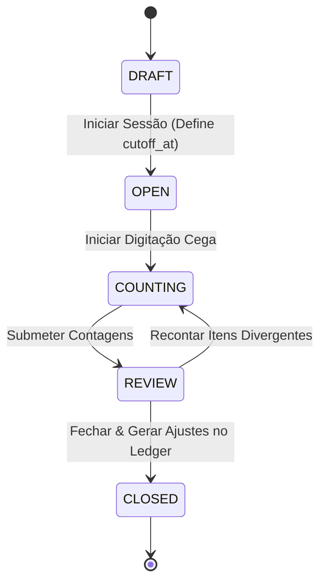
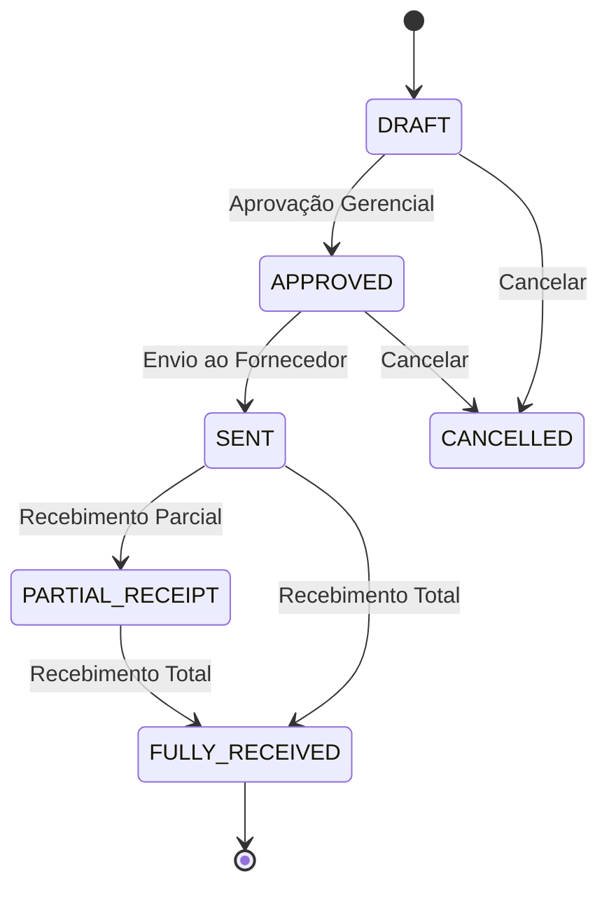
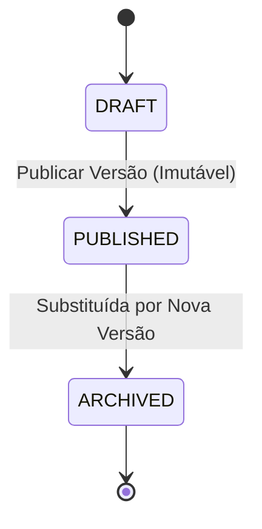
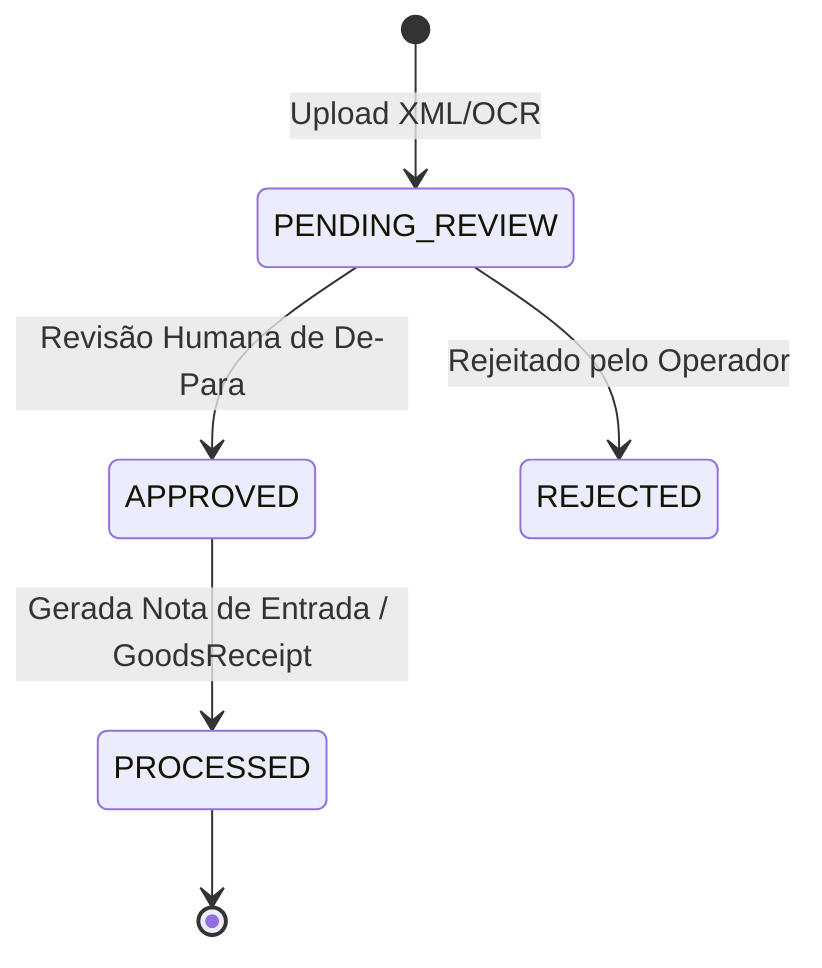

# Máquinas de Estados do Domínio — KS FoodOps

## 1. Sessão de Inventário Físico (`InventorySession`)

## 2. Ordem de Compra (`PurchaseOrder`)

## 3. Ficha Técnica / Receita (`RecipeVersion`)

## 4. Documento NF-e Ingerido (`DocumentExtraction`)

